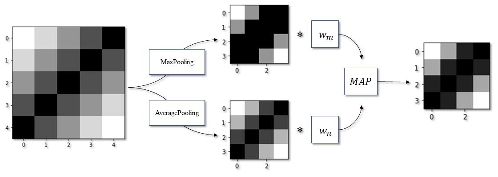
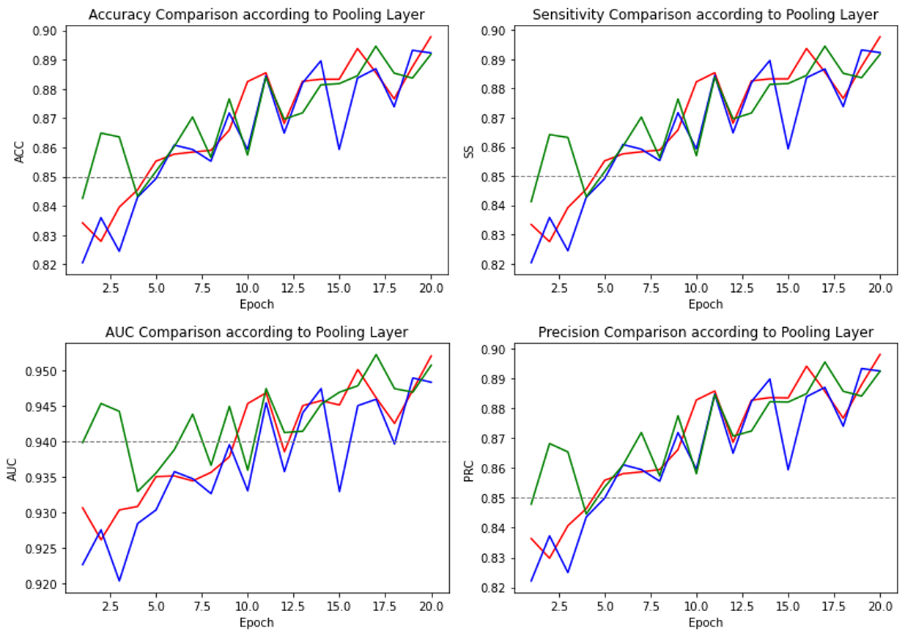

# MaxAvgPooling

*CUAI - Deep Learning, Deep2Deep2Deep*

### [Paper](http://nciss.or.kr/conference/file_down.asp?file_idx=517) | [Site](http://ngcists.org/conference/proceeding_info.asp?journal_idx=1069) 

<p align="center">
  
</p>

**A comparative study of MaxAvgPooling ensemble learning for maintaining stable feature maps of convolutional neural network**
<br>[BumSoo Kim](https://github.com/gh-BumsooKim)\*
<br>Graphics Realization Lab, CAU
<br>In Proceedings Vol.4 No.13 PP.49-52 NCISS 2021 (* CAU A&T)


#### Environment

Using [Anaconda](https://www.anaconda.com/). 

```cmd
(env_name) C:> conda create python=3.6.12
(env_name) C:> conda install tensorflow==2.1.0
(env_name) C:> conda install matplotlib 
(env_name) C:> pip install opencv-python==4.0.0.21
(env_name) C:> conda install pandas
```

#### Frameworks

- keras(tensorflow)

#### DataSet

 - Landmark Image : [https://dacon.io/competitions/official/235585/data/](https://dacon.io/competitions/official/235585/data/)

#### Custom-Pooling : MaxAvgPooling2D()
```python
# Max pooling and Average pooling operation with scale for 2D spatial data.

MaxAvgPooling2D(
    scale_Max_to_Average=(1, 1),
    **kwargs
)
```

## Result

#### Comparison Test Table (Using [Mnist DataSet](https://en.wikipedia.org/wiki/MNIST_database))

| index | 1 (Default) | 2 | 3 | 4 |
| :---: | :---: | :---: | :---: | :---: |
| 1  | Conv2D       | Conv2D         | Conv2D               | Conv2D                     |
| 2  | ReLU         | **Leaky_ReLU** | ReLU                 | ReLU                       |
| 3  | MaxPooling2D | MaxPooling2D   | **AveragePooling2D** | **MaxAvgPooling2D((1,1))** |
| 4  | Conv2D       | Conv2D         | Conv2D               | Conv2D                     |
| 5  | ReLU         | **Leaky_ReLU** | ReLU                 | ReLU                       |
| 6  | Maxpooling2D | Maxpooling2D   | **Averagepooling2D** | **MaxAvgPooling2D((1,1))** |
| 7  | Conv2D       | Conv2D         | Conv2D               | Conv2D                     |
| 8  | ReLU         | **Leaky_ReLU** | ReLU                 | ReLU                       |
| 9  | MaxPooling2D | MaxPooling2D   | **AveragePooling2D** | **MaxAvgPooling2D((1,1))** |
| 10 | Flatten      | Flatten        | Flatten              | Flatten                    |
| 11 | Dense        | Dense          | Dense                | Dense                      |
| 12 | Dropout(0.4) | Dropout(0.4)   | Dropout(0.4)         | Dropout(0.4)               |
| 13 | Dense        | Dense          | Dense                | Dense                      |
| Epoch_15_Accuracy<br>- Loss<br>- Train / Test | 0.00246471<br>0.9994 / 0.9936 | 0.00208529<br>0.9994 / 0.9934 | 0.00679290<br>0.9986 / 0.9929 | 0.00359770<br>0.9991 / 0.9930 |

<br>

#### Comparison Based on MobileNetV2 (Using [Landmark Image](https://dacon.io/competitions/official/235585/data/))

<p align="center">
  
</p>

## Application

### \**Application with Web Code is [Here](https://github.com/russ82/Deepedeepe) connected with KakaoTalk.*

<br>

- Origin Image
<p align="center">
  
</p>

- MaxPooling
<p align="center">
  
</p>

- AveragePooling
<p align="center">
  
</p>

- **MaxPooling : AveragePooling = 1 : 1**
<p align="center">
  
</p>

- **Pooling \*3**
<p align="center">
  
</p>

- **Pooling \*6**
<p align="center">
  
</p>

## Basic

- Origin Image
<p align="center">
  
</p>

- MaxPooling / AveragePooling / **MaxPooling : AveragePooling = 1 : 1**
<p align="center">
  
</p>
