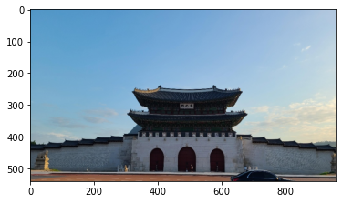
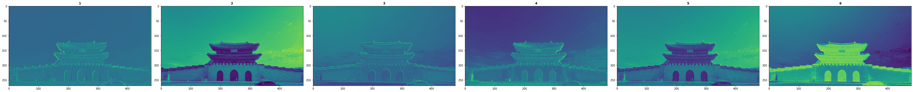
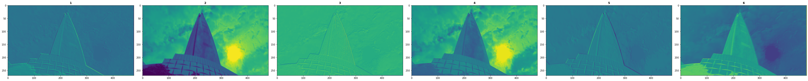
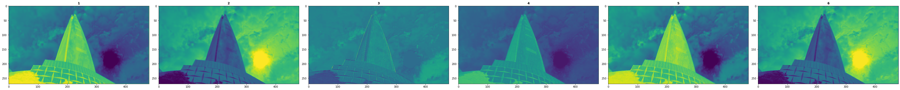
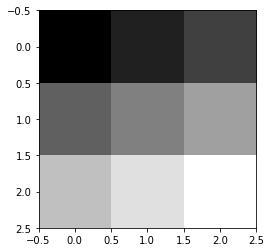
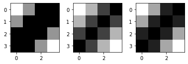
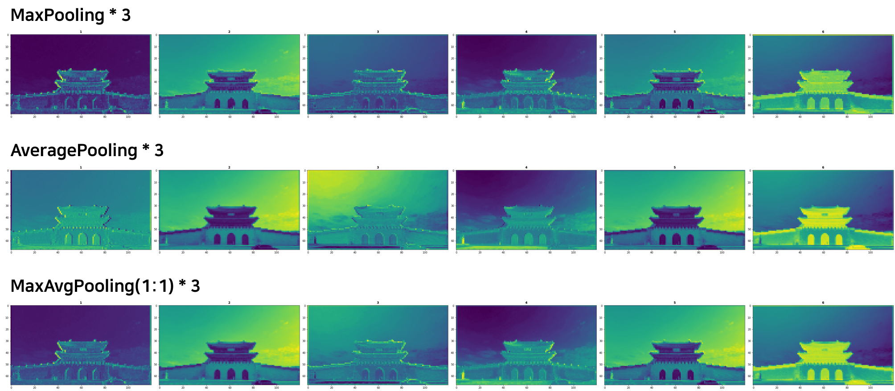
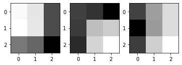

# landmark-classification

*CUAI - Deep Learning, Deep2Deep2Deep*

### [Paper]() | [Site]() 

#### Environment

- conda create python=3.6.12
- conda install tensorflow==2.1.0
- conda install matplotlib 
- pip install opencv-python==4.0.0.21

#### Fraemworks

- keras

#### DataSet

 - Landmark Image : [https://dacon.io/competitions/official/235585/data/](https://dacon.io/competitions/official/235585/data/)
 
#### Application

- Origin Image

  

- MaxPooling

  

- AveragePooling

  

- MaxPooling : AveragePooling = 3 : 2

  

#### Basic

- Origin Image

  

- MaxPooling

  

- AveragePooling

  

- MaxPooling : AveragePooling = 3 : 2

  

