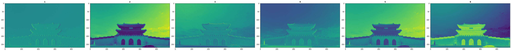
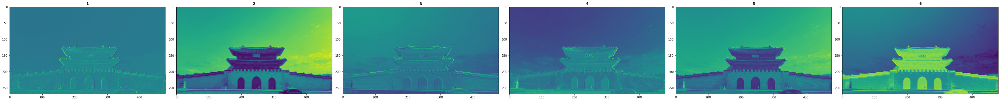
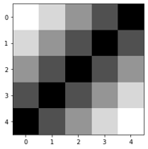
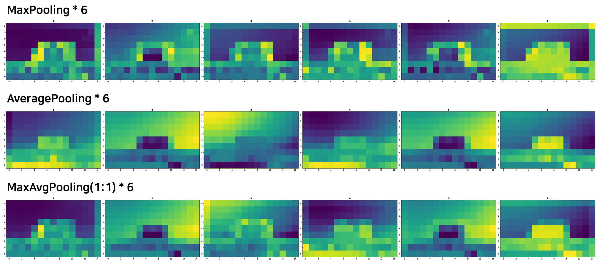

# landmark-classification

*CUAI - Deep Learning, Deep2Deep2Deep*

### [Paper]() | [Site]() 

#### Environment

- conda create python=3.6.12
- conda install tensorflow==2.1.0
- conda install matplotlib 
- pip install opencv-python==4.0.0.21
- conda install pandas

#### Fraemworks

- keras

#### DataSet

 - Landmark Image : [https://dacon.io/competitions/official/235585/data/](https://dacon.io/competitions/official/235585/data/)
 
#### Activation Comparison Table (Using [Mnist DataSet](https://en.wikipedia.org/wiki/MNIST_database))

| index | 1 (Default) | 2 | 3 |
| :---: | :---: | :---: | :---: |
| 1  | Conv2D       | Conv2D         | Conv2D               |
| 2  | ReLU         | **Leaky_ReLU** | ReLU                 |
| 3  | MaxPooling2D | MaxPooling2D   | **AveragePooling2D** |
| 4  | Conv2D       | Conv2D         | Conv2D               |
| 5  | ReLU         | **Leaky_ReLU** | ReLU                 |
| 6  | Maxpooling2D | Maxpooling2D   | **Averagepooling2D** |
| 7  | Conv2D       | Conv2D         | Conv2D               |
| 8  | ReLU         | **Leaky_ReLU** | ReLU                 |
| 9  | MaxPooling2D | MaxPooling2D   | **AveragePooling2D** |
| 10 | flatten      | flatten        | flatten              |
| 11 | dense        | dense          | dense                |
| 12 | dropout      | dropout        | dropout              |
| 13 | dense        | dense          | dense                |
| Epoch_15_Accuracy - Loss - Train / Test | 0.00246471 0.9994 / 0.9936 | 0.00208529 0.9994 / 0.9934 | 0.00679290 0.9986 / 0.9929 |

## Application

- Origin Image

  

- MaxPooling

  

- AveragePooling

  

- MaxPooling : AveragePooling = 3 : 2

  

## Basic

- Origin Image

  

- MaxPooling

  

- AveragePooling

  

- MaxPooling : AveragePooling = 3 : 2

  

